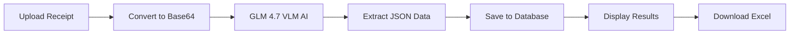

<div align="center">

<h1>ReceiptLens</h1>
---

## Demo Video

[Watch on YouTube](https://www.youtube.com/watch?v=w2Nn6hD6m3o)

---
<p><strong>AI-Powered Receipt Scanner & Data Extractor</strong></p>

<p>Turn receipt images into structured data and downloadable Excel spreadsheets — powered by GLM 4.7 Vision AI</p>


<p>
  
  
  
  
  
  
</p>

</div>

---

## Overview

**ReceiptLens** is a full-stack web application that uses advanced AI vision models to extract structured data from receipt images (JPG, PNG, PDF) and converts them into professionally formatted Excel spreadsheets. Simply upload a receipt photo — or snap one with your camera — and the AI instantly identifies the store name, date, purchased items with prices, tax, discounts, payment method, and total.

No sign-up required. Upload, scan, download — it just works.

---

## Features

| Feature | Description |
|---------|-------------|
| **AI-Powered OCR** | GLM 4.7 Vision AI extracts data from receipts of any format with high accuracy |
| **Excel Export** | Convert extracted data into professionally formatted `.xlsx` spreadsheets instantly |
| **Camera Capture** | Snap receipts directly from your mobile camera for quick processing |
| **Smart Dashboard** | Track spending patterns with monthly charts, store breakdowns, and stats |
| **Receipt History** | Search, filter, sort, and manage all your processed receipts |
| **Receipt Detail View** | View full receipt data with image preview, items table, and raw AI text |
| **Dark / Light Mode** | Seamless theme switching with system preference detection |
| **Responsive Design** | Mobile-first design that works beautifully on any screen size |
| **No Auth Required** | Everyone can use the app without creating an account |

---

## Tech Stack

```
Frontend:
  Next.js 16 (App Router)     React 19         TypeScript 5
  Tailwind CSS 4              shadcn/ui         Framer Motion
  Recharts                    Lucide Icons      Sonner (Toasts)
  Zustand (State)             next-themes

Backend:
  Next.js API Routes          Prisma ORM        SQLite
  z-ai-web-dev-sdk (VLM)      ExcelJS           Sharp
```

---

## Project Structure

```
src/
├── app/
│   ├── api/
│   │   ├── receipts/
│   │   │   ├── upload/route.ts          # Upload + AI extraction
│   │   │   ├── route.ts                 # List receipts (search, sort, paginate)
│   │   │   ├── [id]/route.ts            # Get/delete single receipt
│   │   │   └── download/[id]/route.ts   # Generate Excel download
│   │   └── dashboard/stats/route.ts     # Dashboard analytics
│   ├── layout.tsx
│   ├── page.tsx
│   ├── error.tsx
│   └── global-error.tsx
├── components/
│   ├── receiptlens/
│   │   ├── Header.tsx                   # Navigation + theme toggle
│   │   ├── Footer.tsx                   # "Developed by Ehtashamul"
│   │   ├── LandingView.tsx              # Hero + features + CTA
│   │   ├── DashboardView.tsx            # Stats, charts, recent receipts
│   │   ├── UploadView.tsx               # Drag-and-drop + camera + AI flow
│   │   ├── HistoryView.tsx              # Searchable receipt list
│   │   └── ReceiptDetailView.tsx        # Full receipt details
│   ├── ui/                              # shadcn/ui components
│   └── providers.tsx                    # ThemeProvider
├── lib/
│   ├── db.ts                            # Prisma client
│   ├── guest.ts                         # Guest user management
│   └── utils.ts                         # Utility functions
├── store/
│   └── app-store.ts                     # Zustand state management
└── hooks/
    ├── use-mobile.ts
    └── use-toast.ts
```

---

## How It Works



1. **Upload** — Drag & drop, browse, or snap a photo (JPG/PNG/PDF, max 10MB)
2. **AI Analysis** — The receipt image is sent to **GLM 4.7 Vision Language Model** which identifies and extracts:
   - Store name, date, and time
   - Line items with name, quantity, unit price, and total
   - Subtotal, tax, discount, and grand total
   - Payment method and currency
3. **Database** — All extracted data is stored in SQLite via Prisma ORM
4. **Download** — One-click export to a formatted Excel spreadsheet with summary and items sheets

---

## Getting Started

### Prerequisites

- [Node.js](https://nodejs.org/) 18+ or [Bun](https://bun.sh/)
- A [z-ai-web-dev-sdk](https://www.npmjs.com/package/z-ai-web-dev-sdk) API key (set in environment)

### Installation

```bash
# Clone the repository
git clone https://github.com/ehtashamul56/receiptlens.git
cd receiptlens

# Install dependencies
bun install

# Set up database
cp .env.example .env    # Edit with your config
bun run db:push

# Start development server
bun run dev
```

Open [http://localhost:3000](http://localhost:3000) in your browser.

---

## API Endpoints

| Method | Endpoint | Description |
|--------|----------|-------------|
| `POST` | `/api/receipts/upload` | Upload receipt image + AI extraction |
| `GET` | `/api/receipts` | List receipts (search, sort, pagination) |
| `GET` | `/api/receipts/:id` | Get single receipt details |
| `DELETE` | `/api/receipts/:id` | Delete a receipt |
| `GET` | `/api/receipts/download/:id` | Download Excel spreadsheet |
| `GET` | `/api/dashboard/stats` | Dashboard analytics data |

---

## AI Extraction Response

The AI returns structured JSON for each receipt:

```json
{
  "storeName": "Walmart Supercenter",
  "date": "2024-12-15",
  "time": "14:32",
  "items": [
    { "name": "Organic Milk 1L", "quantity": 2, "unitPrice": 4.99, "totalPrice": 9.98 },
    { "name": "Whole Wheat Bread", "quantity": 1, "unitPrice": 3.49, "totalPrice": 3.49 },
    { "name": "Free Range Eggs x12", "quantity": 1, "unitPrice": 5.29, "totalPrice": 5.29 }
  ],
  "subtotal": 18.76,
  "tax": 1.50,
  "discount": 0,
  "total": 20.26,
  "paymentMethod": "Visa Debit",
  "currency": "USD"
}
```

---

## Screenshots

> Coming soon — the app features a modern emerald/teal themed UI with smooth Framer Motion animations, responsive layouts, and intuitive drag-and-drop interactions.

---

## License

This project is licensed under the MIT License.

---

<div align="center">

<p>
  Built with Next.js, Tailwind CSS, shadcn/ui & GLM 4.7 AI
</p>
<p>
  Developed by <strong>Ehtashamul</strong>
</p>

</div>
